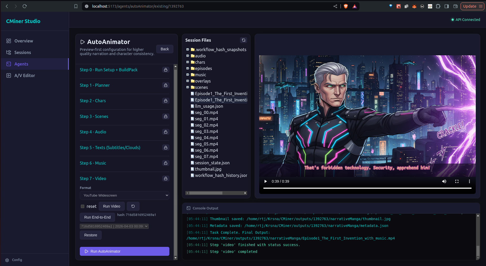

# CMiner - Agentic Pipelines for Content Creation through AI

CMiner is a powerful multi-agent framework designed for high-quality automated content generation. It currently features specialized agents for cinematic podcasting and automated news analysis.



## ✅ Feature Coverage (Current)

This repository now supports a production-grade, session-aware, step-wise AI media workflow with both CLI and WebStudio control.

### WebStudio + API orchestration
- Step-wise execution with live logs over WebSocket (`planner`, `chars`, `scenes`, `audio`, `texts/clouds`, `music`, `video`, `all`).
- Existing/new session workflows with automatic state hydration from `session_state.json`.
- Session lock controls per step and backend sync of both locks and settings.
- Session explorer refresh tools for generated files and artifacts.
- Run/redo controls for each stage with reset toggles.
- Model-aware controls in UI and API payload propagation.

### NarrativeManga pipeline
- Episode planning with continuity context and strict JSON storyboard generation.
- Character portrait generation with validation/retry hardening.
- Scene generation anchored to character references.
- TTS generation for panel dialogue.
- Dynamic subtitle/cloud overlay rendering modes including subtitle-only behavior.
- Dedicated Step 6 music generation and Step 7 final video rendering.

### Music generation (Step 6)
- Provider switching in UI/API/CLI:
  - `strudel`
  - `lyria`
- Strudel workflow with detailed console diagnostics (`status/start/play` visibility).
- Lyria workflow via Gemini API music models (`lyria-3-clip-preview`, `lyria-3-pro-preview`).
- Provider/model persisted to session settings and replayed on existing sessions.

### Hash checkpoints + rollback
- Per-step workflow hashes exposed through checkpoint APIs.
- Automatic hash history snapshot capture after successful runs.
- Restore to previous hash for each step from UI dropdown.
- API endpoints for hash history listing and hash-based restore.
- History-aware state refresh in UI after run/redo/restore operations.

### Character workflows
- Planner-derived editable character prompts exposed in UI.
- Per-character regeneration (single-char redo) without rerunning full char step.
- Single-char redo console stdout/stderr returned and shown in terminal pane.
- LLM usage tracking updates include redo flows.

### Reliability + quality improvements
- Hardened image generation to avoid placeholder/yellow/invalid outputs.
- Legacy multimodal payload compatibility normalization for image parts.
- Better synchronization of session metadata and step configuration.

### Outputs and metadata
- Session-scoped outputs in `outputs/<session_id>/narrativeManga`.
- Final video metadata and thumbnails generated with movie output.
- Music assets and planning files persisted under `music/`.

## 🚀 Quick Start

### 1. Prerequisites
- **Python:** 3.10+
- **FFmpeg:** Required for video compositing and audio processing.
  ```bash
  # Linux
  sudo apt update && sudo apt install ffmpeg
  ```

### 2. Setup Environment
Clone the repository and initialize the conda environment:

```bash
# Create environment (one-time)
conda create -n py_lts python=3.11 -y

# Install dependencies into py_lts
conda run -n py_lts pip install -r requirements.txt

# Run commands in py_lts
conda run -n py_lts python main.py --help

```

### 3. API Configuration
Create a `.env` file in the root directory and add your Google Gemini API key:

```env
GOOGLE_API_KEY=your_gemini_api_key_here
```

## 🤖 Agents

All functionality is accessible via the root `main.py` entry point.

### Podcasting Agent
Generates cinematic text-to-video podcasts with character consistency and real-time text clouds.

#### 🏁 End-to-End
```bash
python3 main.py podcasting --prompt "A debate about AI ethics"
```

#### 🏗️ Modular & Resume Workflow
Execute individual phases to review or refine intermediate outputs. State is persisted in your session directory (found in `outputs/`).

1. **Plan:** `python3 main.py podcasting --prompt "Your topic" --step planner`
2. **Images:** `python3 main.py podcasting --session outputs/XXXXXXX/podCasting --step images`
3. **Audio:** `python3 main.py podcasting --session outputs/XXXXXXX/podCasting --step audio`
4. **Overlays:** `python3 main.py podcasting --session outputs/XXXXXXX/podCasting --step clouds`
5. **Render:** `python3 main.py podcasting --session outputs/XXXXXXX/podCasting --step video`

> [!TIP]
> **Resume Logic**: The agent now supports incremental generation. If you use the `--session` flag and an asset (e.g., `base_scene.png`) already exists, the generator will **skip** the API call and use the local file. This is perfect for resuming failed runs or tweaking individual steps without regenerating everything.

*See [agents/podcasting/README.md](agents/podcasting/README.md) for advanced modular usage and asset injection.*

### Newsdesk Agent
Automates news gathering and analysis reports.

```bash
python3 main.py newsdesk --agent newsaligator --hours 24
```

### NarrativeManga Agent
Generates episodic, cinematic manga-style videos with high character consistency and plot continuity.

#### 🎬 Episodic Workflow
The agent manages series state and allows for sequential episode generation.

*   **Start a New Series**:
    ```bash
    python3 main.py narrativeManga --prompt "A sci-fi detective noir"
    ```
*   **Plan the Next Episode**:
    ```bash
    python3 main.py narrativeManga --session outputs/XXXXXXX/narrativeManga --episodes continue
    ```
*   **Develop the Next Episode**:
    ```bash
    python3 main.py narrativeManga --session outputs/XXXXXXX/narrativeManga --episodes continue --develop
    ```

#### 🛠️ Modular Pipeline
Similar to the Podcasting agent, NarrativeManga can be run step-by-step:
- `planner`: Storyboard and character design.
- `chars`: Reference portraits for consistency.
- `scenes`: Multi-modal panel generation using portraits.
- `audio`: TTS with synchronized word timing.
- `clouds`: Dynamic speech bubble placement (OpenCV).
- `video`: Final FFmpeg assembly.

#### ✨ New narrativeManga features (in this branch)
- Theme preset support (`--theme`) for narrative templates (scary stories, mystery, slice-of-life).
- Art style presets (`--preset`) and multi-output format presets (`--format`, including tiktok/instagram/youtube specs).
- Configuration in `agents/narrativeManga/config.json` for themes, art_styles, output_presets, and voice pools.
- UI form with theme/art/format options in `web-studio/src/pages/Agents.jsx`.
- `MovieMaker` now supports optional music mixing (`--enable_music`) and auto metadata/thumbnail generation.
- Anchor metadata support in char generation (`char_anchors.json`) for better scene consistency.
- Session instrumentation in `session_state.json` includes settings and run metadata.

> [!IMPORTANT]
> **Character Consistency**: This agent uses multimodal anchoring. Portraits generated in the `chars` step are used as references for all subsequent `scenes`, ensuring characters look the same across the entire series.

## 📂 Project Structure

- `agents/`: Contains specialized autonomous agents.
  - `podcasting/`: Cinematic video generation pipeline.
  - `newsdesk/`: News analysis and reporting.
- `main.py`: The unified CLI entry point for all agents.
- `outputs/`: Default directory for session-based generation results.
- `config.json`: Global configuration for the framework.

## 🛠️ Development

To add a new agent:
1. Create a directory in `agents/`.
2. Implement your logic with standard input/output patterns.
3. Register the agent in `main.py`.

---
*Built with ❤️ using Google Gemini & Advanced Agentic Coding.*
